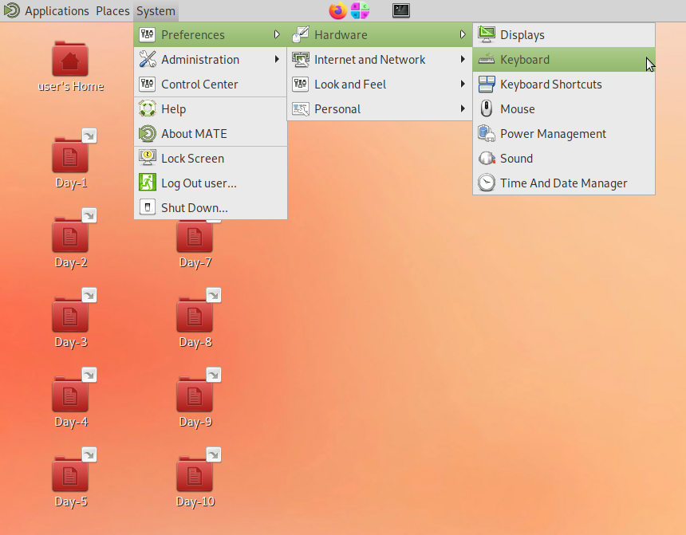
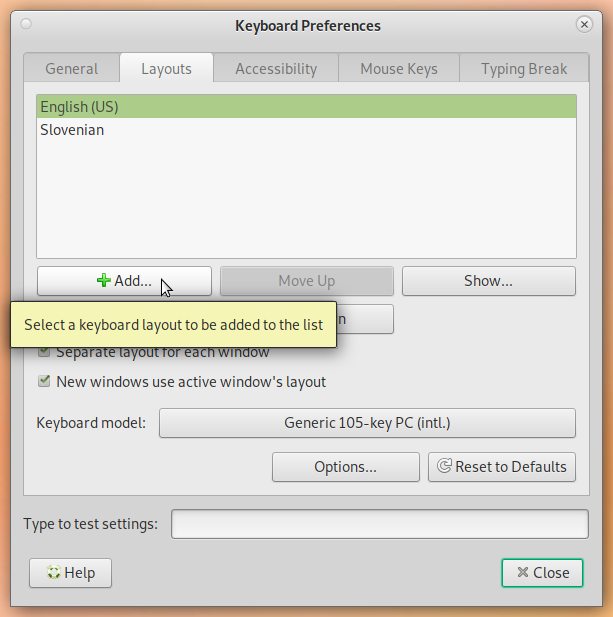
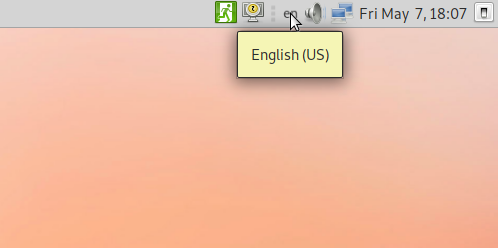
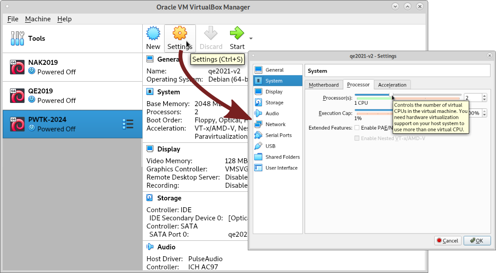
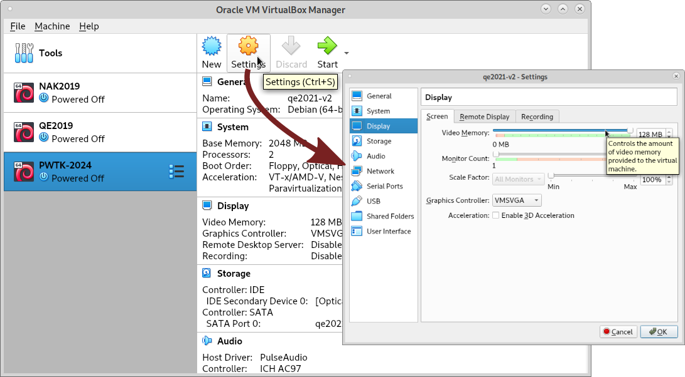
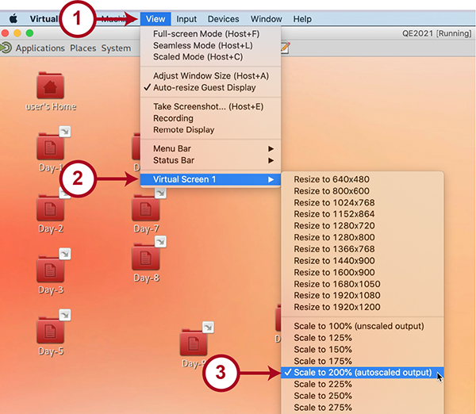
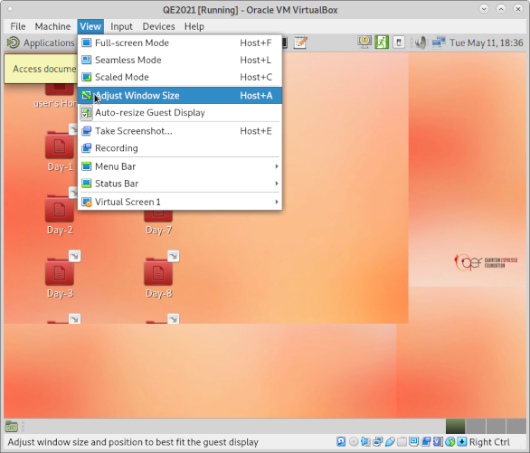

# ReproEnv
Dockerfiles and other environment management tools for the CECAM workshop

# Virtual Machine Installation for Hands-On Sessions
All-inclusive **CECAM-LTS-MAP  Virtual Machine** (size: **5.7G**) that contains the software and material required for the [Long time multi-scale simulations of activated events: from theory to practice](https://www.cecam.org/workshop-details/long-time-multi-scale-simulations-of-activated-events-from-theory-to-practice-1317) is available at:
> [URL1](https://bioad.ijs.si/download/Activated-Events-CECAM.ova)  
> [URL2](http://pwtk.ijs.si/download/Activated-Events-CECAM.ova)

The sha256 checksum of the FILENAME file:  
c4ccd19883538025b08ff43cf21466791cc6a7eac2c73d3c6e4a17be6c244666
Note that sometimes the google chrome browser doesn't download `*.ova` files correctly, if you encounter any issues you can try an alternative browser, or `wget`. 

CECAM-LTS-MAP Virtual Machine image is the same irrespective of which host operating system is used (Linux, Mac OS, or Windows). The virtual machine depends on the [VirtualBox](https://www.virtualbox.org/) virtualization software (version 7.0) and is based on [Debian OS](https://www.debian.org/).

## Hardware requirements

A computer (laptop or desktop) must support **virtualization** and have about **15G** of free disk space.

## Installation instructions

To install **CECAM-LTS-MAP Virtual Machine** follow these steps:

1.  Download and install **[VirtualBox](https://www.virtualbox.org/)** (click a large blue "Download VirtualBox 7.0" button therein).
2.  After VirtualBox is installed and QE-MaX-2024 Virtual Machine downloaded from the [above link](URL1), import the machine by either double clicking it or from the **File→Import Appliance** menu of VirtualBox.

## How to login

Once **CECAM-LTS-MAP Virtual Machine** is imported into VirtualBox, click the green "Start" arrow on the VirtualBox manager window. After the machine is booted, the login screen appears. To login use:

> username: **user**  
> password: **ts2024**
> 
## Keyboard settings

By default, a system is set to US keyboard. You can change this or add new keyboards by going to (upper left corner of the Desktop environment): **System→Preferences→Hardware→Keyboard**

The following window appears (new keyboard layouts can be added by clicking the "+Add" button):

The keyboards can then be switched on the right part of the top-panel:

## Changing the number of CPUs

If your computer has several CPUs then you can increase the number of CPUs that _CECAM-LTS-MAP Virtual Machine_ will use as to make the calculations run faster. This can be done as follows: close the CECAM-LTS-MAP virtual-machine and in the _VirtualBox Manager_ select the _CECAM-LTS-MAP Virtual Machine_ but do not start it. Then press the _Settings_ button and in the window that appears select _System_ tab and increase (or decrease) the number of CPUs accordingly.

## Troubleshooting

On some laptops **virtualization is disabled** by default. If you encounter any issues, this is the first thing to check. In general you should **reboot** the system, enter the **BIOS** and search for a **virtualization** option and make sure it is enabled. Some general instruction on how to do this are available **[here](https://helpdeskgeek.com/how-to/enable-virtualization-in-the-bios/)**.

### Black screen issue

If you get a black screen, you may need to change the video memory in the Settings. Close the _CECAM-LTS-MAP Virtual Machine_ and then in the _VirtualBox Manager_ select the _CECAM-LTS-MAP Virtual Machine_ but do not start it. Then press the _Settings_ button and in the window that appears select Display tab and change (increase) the Video Memory.

### Issue with VirtualBox on Windows 10

It has been reported that sometimes virtual machine does not start on Windows 10, despite virtualization being enabled in the BIOS. In this case, see [Virtual box is not working on windows 10](https://superuser.com/questions/1391838/virtual-box-is-not-working-on-windows-10).

### Notice to MAC users

If _CECAM-LTS-MAP Virtual Machine_ opens in a small window, it is possible to solve the problem as follows:

1.  login (see below) without trying to resize the window
2.  once desktop environment of _CECAM-LTS-MAP Virtual Machine_ appears, click on Cmd+C button
3.  if Cmd+C doesn't solve the problem, use the following menu on the "VirtualBox VM": _View->Virtual Screen 1->Scale to ..._ (you need to select appropriate value of scaling)

### Problem with high DPI screens

On high DPI screens, text and icons in the VM may appear too tiny. This issue can be solved as illustrated by the below snapshot via the _View_ menu of the VM main window.

### Ugly layout upon resizing the VM window size

If you get an ugly layout of VM's desktop upon resizing the VM main window, use the View->Adjust Window Size menu on the "VirtualBox VM" as shown below:

### Other issues

If there are any other issues or if you are unable to load the _CECAM-LTS-MAP Virtual Machine_, try to search for tips on the internet. As a last resort, we will try to help you on-line at the beginning of the school.
